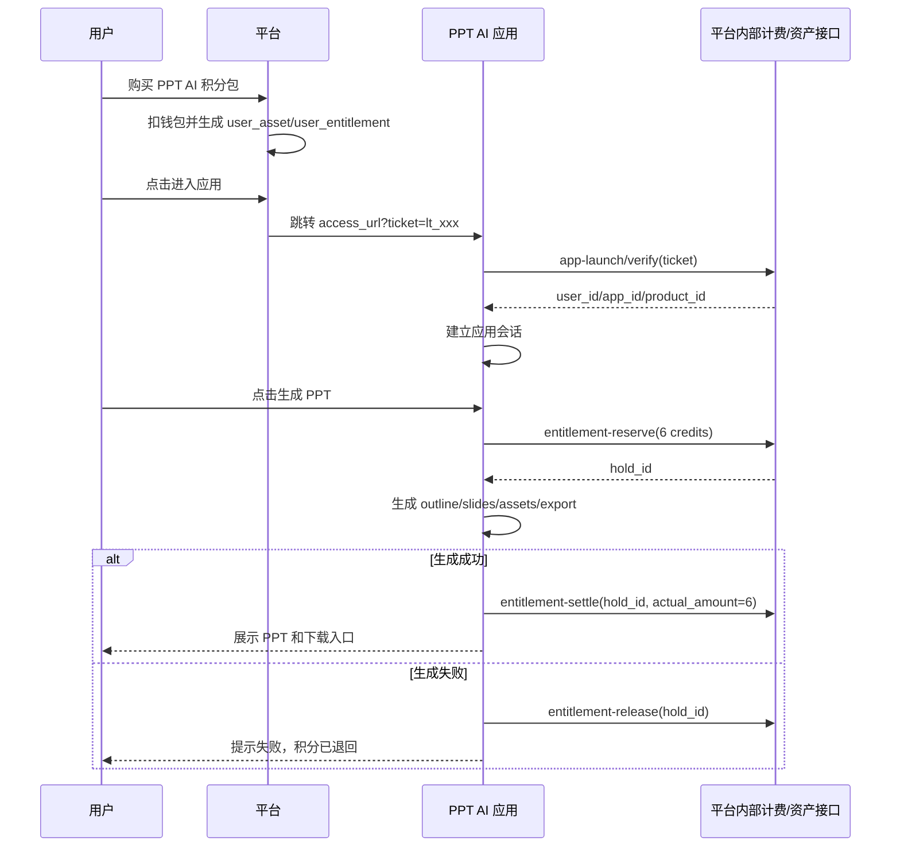
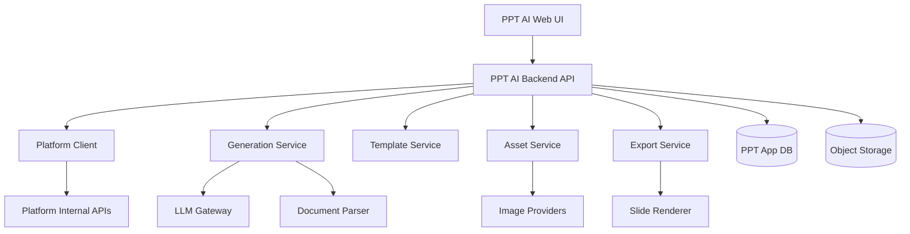
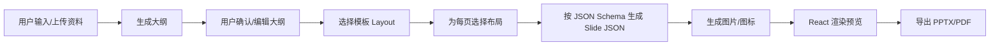

# PPT AI 应用接入与实现设计文档

> 本文面向平台方与 PPT AI 应用开发者，说明如何把一个类似 Presenton 的 AI PPT 生成能力做成平台应用，供平台用户购买积分后使用。
>
> 配套阅读：
> - `./developer-integration-guide.md`
> - `./billing-integration-spec.md`
> - `./developer-requirements.md`
> - `./platform-resource-auth-checklist.md`
> - `../presenton-analysis.md`

---

## 1. 目标

建设一个「PPT AI 生成器」应用，作为平台中的可售卖应用商品提供给用户使用。

第一版采用 **prepaid 积分制**：

- 用户在平台购买积分包。
- 平台为用户生成应用资产 `user_asset` 和额度权益 `user_entitlement`。
- 用户从平台进入 PPT AI 应用。
- PPT AI 应用通过 SSO 一次性票据换取平台 `user_id`。
- 用户生成、修改、生成图片、导出时扣减积分。
- 贵操作使用 `reserve -> settle/release`，轻操作使用 `consume`。

核心设计原则：

- 平台负责「卖、收钱、资产、额度、对账」。
- PPT AI 应用负责「PPT 生成、编辑、导出、扣积分调用」。
- 不改平台计费核心，不把 PPT 生成逻辑塞进平台主业务。
- PPT 生成采用「大纲 -> 模板布局 -> Slide JSON -> 渲染 -> 导出」的确定性链路。

---

## 2. 范围

### 2.1 第一版必须实现

- 平台 SSO 票据免登。
- 用户资产校验。
- 用户积分余额展示。
- 输入主题生成 PPT。
- 上传辅助资料生成 PPT，第一版可先支持 `.txt`、`.pdf`，后续扩展 `.docx`、`.pptx`。
- 大纲生成和确认。
- 固定模板选择，建议首版 3-5 套模板。
- 按模板 JSON Schema 生成 slide 内容。
- 在线预览和基础编辑。
- PDF/PPTX 导出。
- 生成失败自动释放预占积分。
- 生成任务和导出任务状态查询。

### 2.2 第一版暂不做

- 多人协作。
- 企业空间。
- 高级自定义模板编辑器。
- 模板市场。
- API 开放平台。
- MCP 集成。
- 桌面客户端。
- 复杂会员功能门禁。

这些能力可以作为第二阶段或商业化增强阶段建设。

---

## 3. 计费设计

### 3.1 计费模型

采用平台已有 prepaid 额度模型。

用户购买积分包时，平台在购买链路中扣钱包，并生成：

- `user_asset`：表示用户拥有 PPT AI 应用使用权。
- `user_entitlement`：表示用户拥有一定数量的积分额度。

PPT AI 应用使用时只扣额度，不直接扣钱包。

### 3.2 usage_type 约定

建议平台配置以下 usage type。虽然 prepaid 扣额度不通过 `product-usage-events` 扣钱包，但仍建议在应用适配器和运营文档中保持一致命名，便于统计和后续扩展。

| usage_type | 动作 | 扣减方式 | 建议积分 |
|---|---|---|---|
| `ppt_generate` | 生成完整 PPT | `reserve -> settle/release` | 6 |
| `ppt_outline_regenerate` | 重新生成大纲 | `consume` | 1 |
| `ppt_slide_edit` | 修改单页 | `consume` | 2 |
| `ppt_image_generate` | 生成图片 | `consume` | 1/张 |
| `ppt_export` | 导出 PPTX/PDF | `consume` 或免费 | 0 或 1 |

第一版建议：

- `ppt_generate = 6`
- `ppt_slide_edit = 2`
- `ppt_image_generate = 1`
- `ppt_export = 0`

导出首版免费可以降低用户心理阻力。后续如果导出成本较高，再改成 1 积分。

### 3.3 积分包设计

| 套餐 | 积分 | 建议定位 |
|---|---:|---|
| 体验包 | 10 | 适合新用户试用 |
| 基础包 | 50 | 个人用户 |
| 专业包 | 200 | 高频个人或小团队 |
| 企业包 | 1000 | 企业采购或大客户 |

平台套餐 `quota_json` 应声明额度单位：

```json
{
  "quota_total": "50",
  "quota_unit": "credits",
  "valid_days": 365
}
```

实际字段以平台 `product_plans` / `asset` 模块实现为准，本文只定义业务语义。

---

## 4. 平台侧配置

平台方按 `platform-integration-tasks.md` 完成配置。

### 4.1 创建应用

建议应用元数据：

| 字段 | 建议值 |
|---|---|
| `code` | `ppt-ai` |
| `name` | `PPT AI 生成器` |
| `type` | `ai-presentation` |
| `status` | `active` |
| `access_url` | PPT AI 应用入口地址 |
| `usage_event_types_json` | `["ppt_generate","ppt_outline_regenerate","ppt_slide_edit","ppt_image_generate","ppt_export"]` |

### 4.2 挂成商品

商品配置：

| 字段 | 值 |
|---|---|
| `product_type` | `application` |
| `business_ref_id` | `app_id` |
| `product_code` | `ppt-ai-credits` |
| `status` | `active` |

### 4.3 配套餐和价格

每个积分包对应一个 product plan。

示例：

| plan_code | name | quota_total | duration_days |
|---|---|---:|---:|
| `ppt-ai-trial-10` | 体验包 10 积分 | 10 | 365 |
| `ppt-ai-basic-50` | 基础包 50 积分 | 50 | 365 |
| `ppt-ai-pro-200` | 专业包 200 积分 | 200 | 365 |
| `ppt-ai-enterprise-1000` | 企业包 1000 积分 | 1000 | 365 |

价格由运营决定，必须配置默认价，否则普通用户无法购买。

### 4.4 配访问权限

必须给目标用户角色配置：

- `can_view = true`
- `can_buy = true`
- `can_use = true`

否则用户可能看不到应用、买不了商品，或购买后无法使用。

### 4.5 内部接口凭证

平台方需要给 PPT AI 应用服务端提供：

- `API_BASE_URL`
- `INTERNAL_API_TOKEN`
- `app_id`
- `product_id`
- 各 `plan_id`
- 服务器出口 IP 白名单状态
- 测试用户账号和测试积分

敏感值只能通过安全渠道下发，不能写入仓库。

---

## 5. 用户链路



---

## 6. 应用架构



### 6.1 模块职责

| 模块 | 职责 |
|---|---|
| Web UI | 上传资料、填写主题、选择模板、确认大纲、编辑 slides、导出 |
| Backend API | 应用会话、任务编排、状态查询、权限校验 |
| Platform Client | 封装平台 SSO、资产、额度、扣减接口 |
| Generation Service | outline、layout structure、slide JSON 生成 |
| Template Service | 模板、layout、JSON Schema、主题 |
| Asset Service | 图片生成、图标搜索、素材复用 |
| Export Service | PDF/PPTX 导出 |
| LLM Gateway | 多模型封装、JSON Schema 输出、重试、成本统计 |
| Document Parser | 解析上传文件作为生成上下文 |

---

## 7. PPT 生成链路

第一版不要让 LLM 直接生成 PPTX。采用可控链路：



### 7.1 大纲生成

输入：

- 用户主题 `prompt`
- 页数 `slide_count`
- 语言 `language`
- 额外指令 `instructions`
- 上传文档解析后的文本 `context`

输出：

```json
{
  "title": "AI 驱动的企业汇报自动化",
  "slides": [
    {
      "title": "行业背景",
      "content": "企业每周需要大量销售、培训、复盘和项目汇报材料。"
    }
  ]
}
```

### 7.2 模板布局选择

每个模板包含多个 layout。每个 layout 需要声明：

- `layout_id`
- `name`
- `description`
- `json_schema`
- `renderer_component`

LLM 根据 outline 为每页选择 layout index。

### 7.3 Slide JSON 生成

每页根据对应 layout 的 JSON Schema 生成内容。

示例：

```json
{
  "title": "行业背景",
  "bullets": [
    "企业内容生产频率持续提升",
    "人工制作 PPT 成本高、周期长",
    "AI 生成与模板化渲染可以显著提效"
  ],
  "image": {
    "__image_prompt__": "modern office presentation workflow",
    "__image_url__": "/assets/placeholder.jpg"
  },
  "__speaker_note__": "这一页用于说明用户痛点和市场背景。"
}
```

### 7.4 渲染与导出

建议使用同一套 React slide renderer 同时服务：

- 编辑器预览
- PDF 导出
- PPTX 导出

这样可以减少“预览好看，导出变形”的问题。

---

## 8. 积分扣减流程

### 8.1 生成完整 PPT

生成完整 PPT 是贵操作，必须使用预占模式。

```text
1. 创建 generation_task
2. 调 entitlement-reserve，amount=6，idempotency_key=task_id:ppt_generate:reserve
3. 保存 hold_id
4. 执行 PPT 生成
5. 成功后调用 entitlement-settle，actual_amount=6
6. 失败后调用 entitlement-release
7. 更新 generation_task 状态
```

### 8.2 修改单页

修改单页是轻操作，使用一步扣减。

```text
1. 用户提交 slide edit prompt
2. 调 entitlement-consume，amount=2，idempotency_key=edit_task_id:ppt_slide_edit
3. 扣减成功后执行修改
4. 如果修改失败，第一版不自动退回；如果要退回，需要改成 reserve 模式
```

如果用户对失败退款非常敏感，单页修改也可以改为 reserve 模式。

### 8.3 图片生成

```text
1. 用户点击生成图片
2. 调 entitlement-consume，amount=图片数量
3. 成功后调用图片生成 provider
4. 保存图片资产
```

### 8.4 导出

第一版建议免费。

如果后续导出成本较高，则：

```text
entitlement-consume，amount=1，idempotency_key=export_task_id:ppt_export
```

---

## 9. 数据模型建议

PPT AI 应用应有自己的数据库，不把业务数据写进平台核心表。

### 9.1 `ppt_app_sessions`

保存平台用户和应用会话关系。

| 字段 | 说明 |
|---|---|
| `id` | 应用会话 ID |
| `platform_user_id` | 平台 `user_id` |
| `platform_app_id` | 平台 `app_id` |
| `platform_product_id` | 平台 `product_id` |
| `created_at` | 创建时间 |
| `expires_at` | 会话过期时间 |

### 9.2 `presentations`

| 字段 | 说明 |
|---|---|
| `id` | PPT 项目 ID |
| `platform_user_id` | 平台用户 ID |
| `title` | PPT 标题 |
| `prompt` | 用户原始输入 |
| `language` | 语言 |
| `slide_count` | 页数 |
| `template_id` | 模板 ID |
| `outline_json` | 大纲 JSON |
| `structure_json` | layout 选择结果 |
| `theme_json` | 主题配置 |
| `status` | draft/generating/ready/failed |
| `created_at` | 创建时间 |
| `updated_at` | 更新时间 |

### 9.3 `slides`

| 字段 | 说明 |
|---|---|
| `id` | Slide ID |
| `presentation_id` | PPT ID |
| `index` | 页序号 |
| `layout_id` | layout ID |
| `content_json` | 结构化内容 |
| `speaker_note` | 演讲备注 |
| `created_at` | 创建时间 |
| `updated_at` | 更新时间 |

### 9.4 `generation_tasks`

| 字段 | 说明 |
|---|---|
| `id` | 任务 ID |
| `platform_user_id` | 平台用户 ID |
| `presentation_id` | PPT ID |
| `task_type` | ppt_generate/slide_edit/image_generate/export |
| `status` | pending/running/succeeded/failed/refunded |
| `entitlement_id` | 平台 entitlement ID |
| `hold_id` | 预占 ID，仅 reserve 模式有 |
| `reserved_amount` | 预占积分 |
| `settled_amount` | 实扣积分 |
| `idempotency_key` | 幂等键 |
| `error_message` | 错误信息 |
| `created_at` | 创建时间 |
| `updated_at` | 更新时间 |

### 9.5 `assets`

| 字段 | 说明 |
|---|---|
| `id` | 资产 ID |
| `platform_user_id` | 平台用户 ID |
| `presentation_id` | PPT ID |
| `asset_type` | image/export/upload |
| `path` | 对象存储路径 |
| `metadata_json` | prompt、provider、尺寸等 |
| `created_at` | 创建时间 |

---

## 10. 应用接口建议

以下接口为 PPT AI 应用自己的后端接口，不是平台接口。

### 10.1 SSO

```http
GET /auth/launch?ticket=lt_xxx
```

行为：

1. 读取 `ticket`。
2. 调平台 `POST /api/internal/app-launch/verify`。
3. 校验返回的 `app_id/product_id` 是否匹配当前应用。
4. 创建应用 session。
5. 跳转到 `/dashboard`。

### 10.2 当前用户状态

```http
GET /api/me
```

返回：

```json
{
  "platform_user_id": 123,
  "entitlements": [
    {
      "id": 456,
      "quota_total": "50",
      "quota_used": "12",
      "remaining": "38",
      "quota_unit": "credits",
      "usable": true
    }
  ]
}
```

### 10.3 创建生成任务

```http
POST /api/presentations/generate
```

请求：

```json
{
  "prompt": "做一份关于 AI PPT 平台商业模式的融资路演 PPT",
  "slide_count": 10,
  "language": "zh-CN",
  "template_id": "business",
  "instructions": "风格专业，适合投资人"
}
```

行为：

1. 获取用户可用 entitlement。
2. 调平台 `entitlement-reserve` 预占 6 积分。
3. 创建 `generation_task`。
4. 后台执行生成。
5. 返回任务 ID。

### 10.4 查询任务

```http
GET /api/generation-tasks/{task_id}
```

返回任务状态、错误信息、presentation_id。

### 10.5 获取 PPT

```http
GET /api/presentations/{id}
```

返回 presentation、slides、assets。

### 10.6 更新大纲

```http
PUT /api/presentations/{id}/outline
```

### 10.7 修改单页

```http
POST /api/slides/{id}/edit
```

行为：

1. `entitlement-consume` 扣 2 积分。
2. 调 LLM 修改 slide JSON。
3. 保存 slide。

### 10.8 导出

```http
POST /api/presentations/{id}/export
```

返回 export_task_id，完成后返回下载地址。

---

## 11. Platform Client 封装

应用后端应封装平台接口，不要在业务代码里散落 HTTP 调用。

建议接口：

```ts
interface PlatformClient {
  verifyLaunchTicket(ticket: string): Promise<LaunchIdentity>;
  listUserAssets(userId: string): Promise<UserAsset[]>;
  listUserEntitlements(userId: string): Promise<UserEntitlement[]>;
  getEntitlementBalance(userId: string, entitlementId: string): Promise<EntitlementBalance>;
  reserveEntitlement(input: ReserveInput): Promise<ReserveResult>;
  settleEntitlement(input: SettleInput): Promise<SettleResult>;
  releaseEntitlement(input: ReleaseInput): Promise<ReleaseResult>;
  consumeEntitlement(input: ConsumeInput): Promise<ConsumeResult>;
}
```

要求：

- `INTERNAL_API_TOKEN` 从环境变量读取。
- 内部接口 base URL 从环境变量读取。
- 所有扣减请求必须带 `idempotency_key`。
- 对 `60005` 返回明确的「积分不足」业务错误。
- 对 `40003` 返回「登录失效或无权访问」。
- 对网络错误和 5xx 做有限重试，但不能更换幂等键。

---

## 12. 异常处理

### 12.1 积分不足

平台返回 `60005` 时：

- 不创建生成任务，或将任务标记为 `failed`。
- 前端提示用户购买积分包。
- 不调用 LLM。

### 12.2 生成失败

如果已 reserve：

- 必须调用 `entitlement-release`。
- 任务状态标记为 `failed`。
- 记录错误信息。
- 前端提示「生成失败，积分已退回」。

### 12.3 settle 失败

如果 PPT 已生成成功但 settle 失败：

- 任务标记为 `settle_failed` 或 `failed_needs_reconcile`。
- 暂不开放下载。
- 后台任务按同一 `hold_id` 重试 settle。
- 需要运维对账入口。

### 12.4 release 失败

如果生成失败但 release 失败：

- 任务标记为 `release_failed`。
- 后台按同一 `hold_id` 重试 release。
- 前端提示「生成失败，积分退回处理中」。

### 12.5 SSO ticket 无效

平台返回 `40003`：

- 不重试同一 ticket。
- 提示用户重新从平台进入应用。

---

## 13. 安全要求

- `INTERNAL_API_TOKEN` 不入库、不提交代码、不打印日志。
- SSO ticket 只用于一次性换身份，不能作为长期登录凭证。
- 应用必须建立自己的 session。
- 用户只能访问自己的 presentations、slides、exports。
- 上传文件需要限制大小、类型和解析超时。
- 导出文件下载需要鉴权。
- 对 LLM prompt 和文件内容做长度限制，避免成本失控。
- 内部平台接口只能应用后端调用，不能暴露给浏览器。

---

## 14. 前端页面

第一版页面建议：

| 页面 | 功能 |
|---|---|
| `/auth/launch` | 接收平台 ticket 并建立会话 |
| `/dashboard` | PPT 项目列表、积分余额、创建入口 |
| `/create` | 输入主题、上传文件、选择模板、页数和语言 |
| `/outline/:id` | 查看和编辑大纲 |
| `/presentation/:id` | Slide 预览、编辑、重新生成、导出 |
| `/exports/:id` | 导出状态和下载 |

---

## 15. 开发阶段

> 路线决策：**自研生成/渲染/导出链路**（Presenton 仅作参考实现，不封装）。
> 本节给出阶段总览；**任务级拆分（产出物/涉及模块/依赖/验收/负责人）以 [`./ppt-ai-app-roadmap.md`](./ppt-ai-app-roadmap.md) 为准**，两份文档需保持一致。

### 15.0 现状基线（规划起点，非待办）

`ppt-ai-app/` 已具备：SSO 票据校验、余额查询、计费闭环 mock（`reserve → settle/release`，稳定幂等键）、`PlatformClient` 封装、基础测试。
尚不具备（自研链路必须补齐）：持久化（无 DB、session 为内存 `Map`）、前端框架、LLM 接入、模板/渲染、导出、异步任务、对账 worker、对象存储。

> 旧版「阶段 1 平台接入」已完成约 80%，真正的工作从「把 mock 闭环生产化」与「自研生成链路」开始。

### 15.1 阶段总览（6 阶段，按依赖 + 风险排序）

| 阶段 | 目标 | 可演示里程碑 | 风险 |
|---|---|---|---|
| P0 技术选型与骨架 | 定栈、建 DB、项目结构、前端脚手架 | 服务起得来、迁移跑得通、CI 绿 | 中 |
| P1 计费闭环生产化 | mock 闭环 → 持久化 + 对账可靠 | 重启不掉登录；settle/release 失败可自动重试对账 | 高 |
| P2 生成内核 | 异步任务 + LLM 网关 + 大纲/Slide JSON | 输入主题 → 产出符合 Schema 的 slide JSON（无界面） | 高 |
| P3 模板与渲染预览 | 模板/layout + React renderer + 前端页面 | 浏览器里看到可预览的整套 PPT | 中 |
| P4 导出保真 | PDF/PPTX 导出 + 鉴权下载 | 导出文件与预览基本一致 | **最高** |
| P5 增强能力 | 单页编辑/图片生成/文档解析/更多模板 | 上传资料生成、编辑、配图 | 中 |
| P6 上线加固 | 成本护栏/可观测/安全/并发 | 通过验收清单，可对外开量 | 中 |

> 风险前置：LLM Schema 可靠性（P2）与导出保真（P4）各自独立成阶段、独立验收；计费对账（P1）前置到生成之前，确保扣费链路在接真实生成前已可靠。

### 15.2 阶段要点

- **P0 技术选型与骨架**：Fastify 替换裸 http、React(Vite) 前端脚手架、DB + 迁移（SQLite/PG）、对象存储抽象、CI。选型在此定稿后不再回炉（详见 roadmap 第 2 节）。
- **P1 计费闭环生产化**：会话/任务/幂等键持久化、`60005/40003` 错误语义映射、**对账 worker**（按同 `hold_id` 重试 settle/release）。在接真实生成前先把扣费链路做到生产级可靠。
- **P2 生成内核**：异步任务框架、LLM Gateway（默认 Claude）、大纲生成与确认、**Schema 受限 Slide JSON 生成（校验 + 重试 + 降级）**，并接入 `reserve → 生成 → settle/release`。
- **P3 模板与渲染预览**：3–5 套模板/layout、同构 React slide renderer、`/create /outline /presentation` 主流程页面、生成前余额/资产校验。
- **P4 导出保真**（最高风险，独立阶段）：异步导出任务、Puppeteer PDF、PPTX（可编辑优先、复杂页降级为图）、保真回归集、签名鉴权下载。
- **P5 增强能力**：单页编辑（consume 2）、图片生成、`.txt/.pdf` 文档解析、更多模板。
- **P6 上线加固**：成本护栏（LLM/图片配额、长度/速率限流）、可观测与对账告警、并发/多实例正确性、安全审查、跑通 §16 应用侧验收清单。

### 15.3 平台侧并行依赖

平台方需早于 P1 联调就绪（走 `platform-integration-tasks.md`）：建应用/挂商品、配 4 套积分套餐 + 默认价 + `can_view/can_buy/can_use`、配 `usage_event_types_json`/`INTERNAL_API_TOKEN`/IP 白名单、提供测试账号与积分。未就绪将阻塞 P1/P2 真实联调（期间可用 mock PlatformClient 先行，上线前必须真联调）。

### 15.4 开工前必须拍板的决策

1. Slide 生成不合规策略（重试次数/降级/阈值，P2 前）。
2. 图片生成失败是否退费（consume 先扣，失败是否改 reserve，P5 前）。
3. PPTX 复杂页降级规则（P4 前）。
4. 前端用 React 与平台 Vue 体系不一致，需确认团队接受双栈。
5. 异步队列是否引入 Redis（首版 DB job 表是否够用）。

---

## 16. 验收清单

平台侧：

- 应用 active。
- 商品 active。
- 默认价格已配置。
- 访问权限 `can_view/can_buy/can_use` 已配置。
- 积分套餐能购买。
- 购买后能查到 `user_asset` 和 `user_entitlement`。
- `INTERNAL_API_TOKEN` 和 IP 白名单已配置。

应用侧：

- `?ticket=` 能换出 `user_id`。
- 用户只能访问自己的 PPT。
- 积分余额展示正确。
- 生成 PPT 前会 reserve。
- 成功后 settle。
- 失败后 release。
- 修改单页会 consume。
- 幂等键稳定且可复算。
- 余额不足提示购买积分。
- 导出文件鉴权下载。

---

## 17. 关键结论

PPT AI 应用不应复制 Presenton 的所有工程形态。第一版应吸收它最关键的生成思想：

```text
大纲生成 -> 模板布局选择 -> JSON Schema 内容填充 -> React 渲染 -> PPTX/PDF 导出
```

平台接入则严格遵守现有应用商品体系：

```text
平台卖积分包 -> 生成资产和 entitlement -> 应用 SSO 认人 -> 用前校验 -> 用时扣积分
```

这样可以在不侵入平台核心计费系统的前提下，把 PPT AI 做成一个可购买、可控成本、可对账、可逐步扩展的正式应用。

