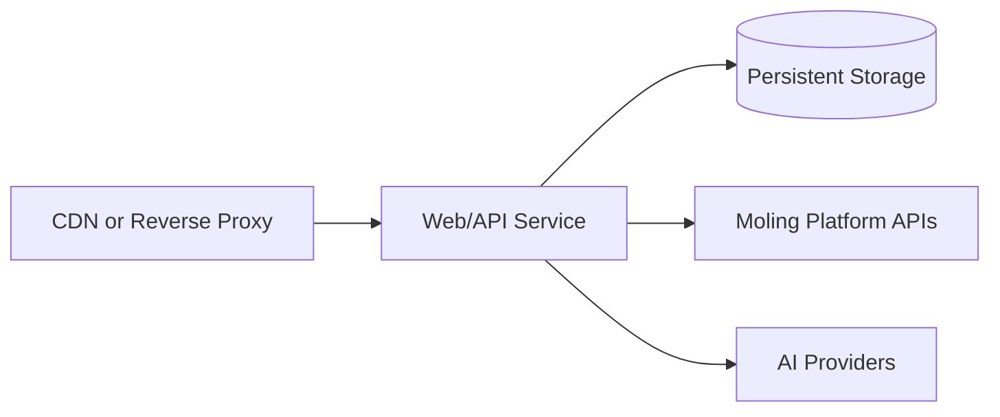

# Deployment Design

## Environments

- local development
- test/staging
- production

Each environment uses environment variables and secret management. No `.env` file with real values is committed.

## Runtime Topology



Current runtime in this branch is single-process: API, workspace, generation orchestration, and billing checks run together, with local JSON persistence.

## Current Docker Assets

- `ppt-ai-app/Dockerfile` builds the foundation API container.
- `docker-compose.yml` runs the app with environment-variable injection and a persistent `./data` volume.
- `docker-compose.prod.yml` provides a production-oriented example with fixed restart and healthcheck strategy.
- `.github/workflows/ci.yml` runs `npm test` for pushes and pull requests.

## Required Services (Current Phase)

- One app container built from `ppt-ai-app/Dockerfile`
- A data volume mounted to `/data` for `json:/data/ppt-ai-db.json` and stored uploads
- Optional reverse proxy (nginx/Traefik) and TLS termination
- Reachable Moling and AI provider endpoints
-
## Configuration

All settings are injected through environment variables:

- Moling base URL and internal token
- application URL and port
- session cookie lifetime through `SESSION_TTL_SECONDS` in seconds; default is 604800
- session cookie `Secure` behavior through `SESSION_COOKIE_SECURE`; defaults to production-safe values when `APP_ENV=production`
- database URL / storage path
- AI provider credentials
- logging level and tracing configuration

The reverse proxy should preserve the app's `X-Request-Id` response header so support tickets and Moling 联调 reports can be matched to backend logs.

For HTTP AI provider deployment, set:

- `LLM_PROVIDER=http`
- `LLM_API_URL`
- `LLM_API_KEY`
- `LLM_TIMEOUT_MS` to bound each provider request, default `30000`
- `LLM_MAX_RETRIES` for transient 5xx/network failures, default `0`

For local pre-production smoke tests without external Moling credentials, set `LOCAL_MOLING_MOCK=true` plus local user and entitlement IDs, then run `npm run acceptance`.

For real Moling platform acceptance, start the app with production-like Moling variables and pass a one-time launch ticket from the Moling entry flow:

```bash
ACCEPTANCE_BASE_URL=http://127.0.0.1:5177 \
ACCEPTANCE_LAUNCH_TICKET=<real_launch_ticket> \
ACCEPTANCE_ENTITLEMENT_ID=<optional_entitlement_id> \
npm run acceptance:moling
```

The real acceptance script exercises SSO launch, template catalog, balance lookup, outline generation, outline editing, deck generation, single-slide regeneration, preview, PPTX/PDF export, file download, call-log checks, and final balance deduction checks against the configured Moling APIs.

## Production Deployment Steps

1. Configure production environment variables (example list):

   - `MOLING_API_BASE_URL`, `INTERNAL_API_TOKEN`
   - `MOLING_APP_ID`, `MOLING_PRODUCT_ID`, `MOLING_DEFAULT_ENTITLEMENT_ID`
   - `LLM_PROVIDER=mock` (local) or `LLM_PROVIDER=http` + `LLM_API_URL` and `LLM_API_KEY`
   - `APP_ENV=production`
   - `SESSION_COOKIE_SECURE=true`
   - `LOCAL_MOLING_MOCK=false`

2. Start the service:

   ```bash
   APP_ENV=production APP_PORT=5177 \
   MOLING_API_BASE_URL=... \
   INTERNAL_API_TOKEN=... \
   MOLING_APP_ID=... \
   MOLING_PRODUCT_ID=... \
   MOLING_DEFAULT_ENTITLEMENT_ID=... \
   docker-compose -f docker-compose.yml up -d --build
   ```

3. Run readiness and sanity checks:

   ```bash
   curl -fs http://127.0.0.1:5177/api/health
   ```

4. Run post-deploy acceptance:

   ```bash
   cd ppt-ai-app
   npm run acceptance
   ```

   In staging or production-linked environments, run `npm run acceptance:moling` with a valid launch ticket.

## Release Strategy

- Build immutable container images.
- Use health checks for rollout/rollback decisions.
- Keep rollback tags ready for one-click recovery if billing reconciliation risk is detected.

## Security Requirements

- Enforce HTTPS at the edge.
- Keep internal API tokens in secret storage.
- Restrict internal admin or reconciliation endpoints by network and authentication.
- Rotate provider keys and platform tokens without code changes.
