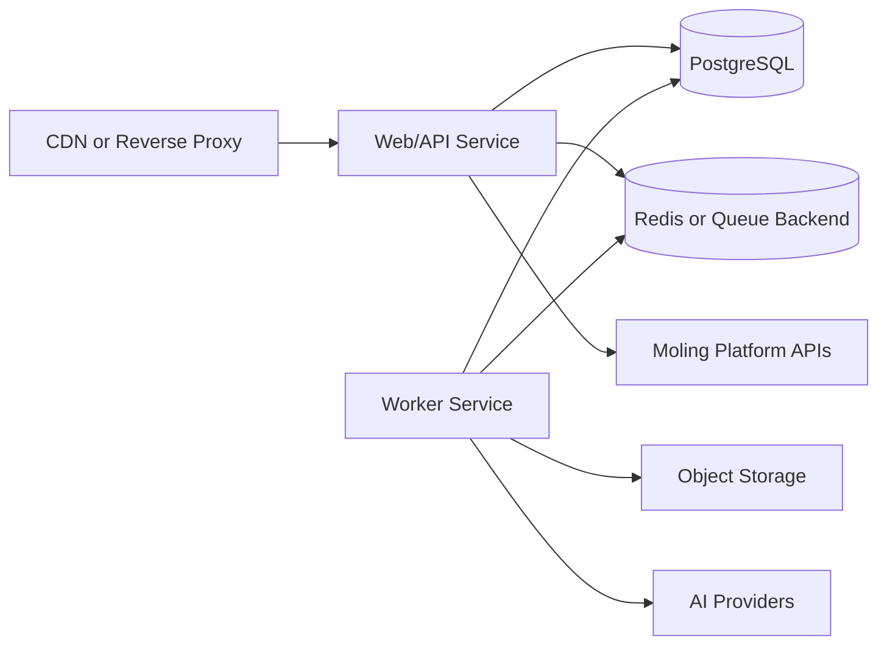

# Deployment Design

## Environments

- local development
- test/staging
- production

Each environment uses environment variables and secret management. No `.env` file with real values is committed.

## Runtime Topology



## Current Docker Assets

- `ppt-ai-app/Dockerfile` builds the foundation API container.
- `docker-compose.yml` runs the app with environment-variable injection and a persistent local data volume.
- `.github/workflows/ci.yml` runs `npm test` for pushes and pull requests.

## Required Services

- Web/API container
- Worker container
- PostgreSQL
- Redis or equivalent queue backend
- Object storage
- Logs and metrics collector

## Configuration

All settings are injected through environment variables:

- Moling base URL and internal token
- application URL and port
- session cookie lifetime through `SESSION_TTL_SECONDS` in seconds; default is 604800
- session cookie `Secure` behavior through `SESSION_COOKIE_SECURE`; default is true in production
- database URL
- queue URL
- object storage credentials
- AI provider credentials
- log level and tracing configuration

The reverse proxy should preserve the app's `X-Request-Id` response header so support tickets and Moling联调 reports can be matched to backend logs.

For HTTP AI provider deployment, set:

- `LLM_PROVIDER=http`
- `LLM_API_URL`
- `LLM_API_KEY`
- `LLM_TIMEOUT_MS` to bound each provider request, default `30000`
- `LLM_MAX_RETRIES` for transient 5xx/network failures, default `0`

For local pre-production smoke tests without external Moling credentials, set `LOCAL_MOLING_MOCK=true` plus local user and entitlement IDs, then run `npm run acceptance`.

For real Moling platform acceptance, start the app with production-like Moling variables and pass a one-time launch ticket from the Moling entry flow:

```bash
ACCEPTANCE_BASE_URL=http://127.0.0.1:5177 \
ACCEPTANCE_LAUNCH_TICKET=<real_launch_ticket> \
ACCEPTANCE_ENTITLEMENT_ID=<optional_entitlement_id> \
npm run acceptance:moling
```

The real acceptance script exercises SSO launch, template catalog, balance lookup, outline generation, outline editing, deck generation, single-slide regeneration, preview, PPTX/PDF export, file download, call-log checks, and final balance deduction checks against the configured Moling APIs.

## Release Strategy

- Build immutable container images.
- Run database migrations before new application rollout.
- Deploy API and workers separately.
- Use health checks for API readiness and worker liveness.
- Roll back by restoring the previous image and pausing workers if billing reconciliation risk is detected.

## Security Requirements

- Enforce HTTPS at the edge.
- Keep internal API tokens in secret storage.
- Restrict internal admin or reconciliation endpoints by network and authentication.
- Rotate provider keys and platform tokens without code changes.
