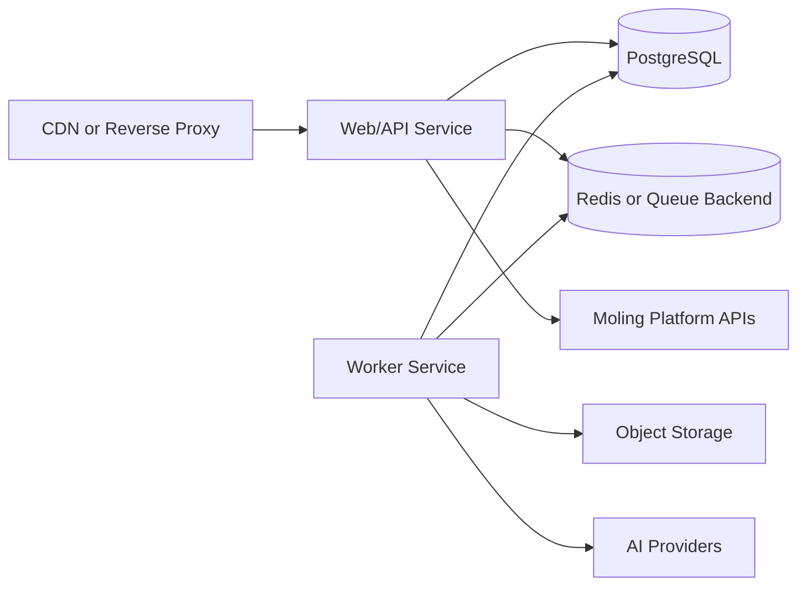

# Deployment Design

## Environments

- local development
- test/staging
- production

Each environment uses environment variables and secret management. No `.env` file with real values is committed.

## Runtime Topology

## Current Docker Assets

- `ppt-ai-app/Dockerfile` builds the foundation API container.
- `docker-compose.yml` runs the app with environment-variable injection and a persistent local data volume.
- `.github/workflows/ci.yml` runs `npm test` for pushes and pull requests.

## Required Services

- Web/API container
- Worker container
- PostgreSQL
- Redis or equivalent queue backend
- Object storage
- Logs and metrics collector

## Configuration

All settings are injected through environment variables:

- Moling base URL and internal token
- application URL and port
- database URL
- queue URL
- object storage credentials
- AI provider credentials
- log level and tracing configuration

For HTTP AI provider deployment, set:

- `LLM_PROVIDER=http`
- `LLM_API_URL`
- `LLM_API_KEY`

For local pre-production smoke tests without external Moling credentials, set `LOCAL_MOLING_MOCK=true` plus local user and entitlement IDs, then run `npm run acceptance`.

## Release Strategy

- Build immutable container images.
- Run database migrations before new application rollout.
- Deploy API and workers separately.
- Use health checks for API readiness and worker liveness.
- Roll back by restoring the previous image and pausing workers if billing reconciliation risk is detected.

## Security Requirements

- Enforce HTTPS at the edge.
- Keep internal API tokens in secret storage.
- Restrict internal admin or reconciliation endpoints by network and authentication.
- Rotate provider keys and platform tokens without code changes.
