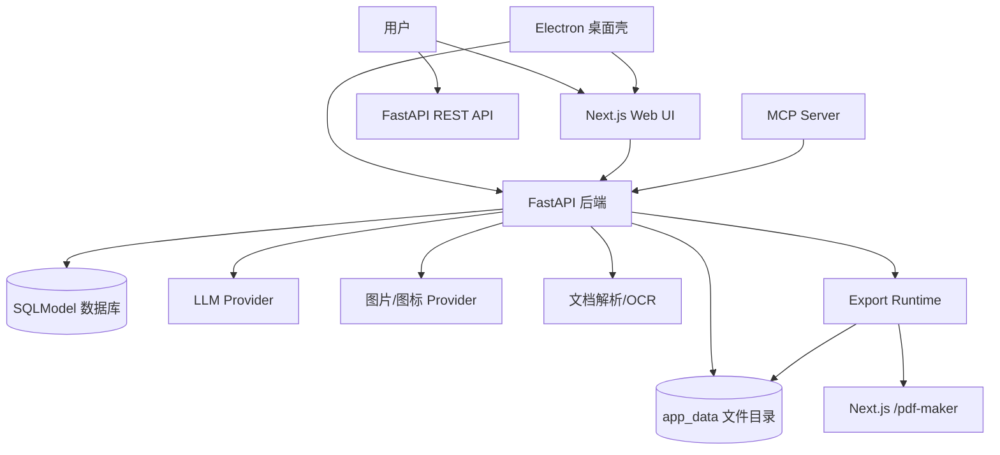
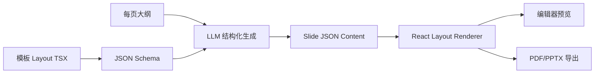
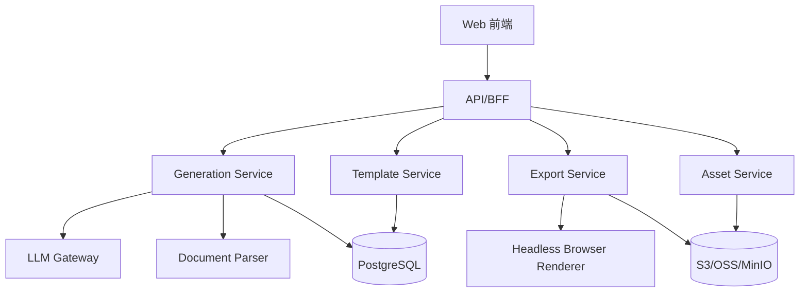

# Presenton 项目实现原理与自研 PPT AI 平台参考文档

分析对象：`https://github.com/presenton/presenton`

本地路径：`/home/pc-w1/ppt/presenton`

分析版本：`2e9bf24`，提交日期 `2026-06-27`

## 1. 项目定位

Presenton 是一个开源 AI PPT 生成平台，核心目标是让用户用自己的模型和密钥生成、编辑、导出 PPT。它不是单纯的“LLM 输出 markdown 再转 PPT”，而是一个完整的 Web/桌面/接口平台：

- Web 应用：Next.js + React，负责上传、配置、生成流程、编辑器、模板管理和导出页面。
- 后端服务：FastAPI，负责 LLM 调用、文件解析、PPT 结构化生成、图片/图标资产、数据库、导出调度、MCP。
- 桌面应用：Electron，把同一套 Next.js UI 和 FastAPI 后端打包成本地应用。
- Docker 部署：Nginx 对外统一暴露 80 端口，内部跑 Next.js、FastAPI 和 MCP。
- API 能力：可直接通过 `/api/v1/ppt/presentation/generate` 同步生成并导出 PPTX/PDF，也支持异步任务。

## 2. 主要功能

### 2.1 PPT 生成

- 从文本 prompt 生成 PPT。
- 从上传文档生成 PPT，后端会解析文档内容作为额外上下文。
- 可指定页数、语言、语气、详细程度、用户指令。
- 支持是否包含标题页、目录页。
- 支持 Web Search，把搜索结果作为事实上下文。
- 支持同步生成、异步生成、前端 SSE 流式生成。

### 2.2 大纲与内容编辑

- 先生成 presentation outline，用户可在前端审核和修改。
- 可更新大纲后再生成正式 slides。
- 支持单页 slide 编辑、HTML 编辑、聊天式修改。
- 前端维护 undo/redo 状态。

### 2.3 模板与主题

- 内置模板。
- 自定义模板：上传 PPTX，预览字体和 slide，生成或编辑 layout TSX 代码。
- 模板 layout 包含 JSON Schema，LLM 必须按 schema 输出结构化 slide content。
- 支持主题生成、主题选择、字体管理。

### 2.4 图片、图标和资产

- 支持 DALL-E 3、GPT Image、Gemini、OpenAI compatible、ComfyUI、Open WebUI 等图片生成。
- 支持 Pexels、Pixabay stock image。
- 支持图标搜索，内置图标向量索引。
- 图片和图标会以占位资产先返回，后端并发补齐真实资产。

### 2.5 导出

- 支持 PPTX 和 PDF。
- 导出通过 Next.js 的 `/pdf-maker` 渲染 presentation 页面，再交给 bundled `presentation-export` runtime 转换。
- Docker 镜像内置 Chromium、ImageMagick、字体、Node、Python 运行环境。

### 2.6 部署与集成

- Docker 单容器部署。
- Electron 桌面应用。
- 内置 MCP Server，可由 OpenAPI spec 自动映射成 MCP 工具。
- 支持 Webhook：生成成功或失败后回调。
- 支持简单认证和 ChatGPT/Codex OAuth 相关配置。

## 3. 技术栈

| 层 | 技术 |
|---|---|
| 前端 | Next.js 16、React 19、TypeScript、Tailwind CSS、Redux Toolkit、Radix UI、TipTap |
| 后端 | Python 3.11、FastAPI、SQLModel、SQLAlchemy async、Alembic |
| LLM 抽象 | `llmai`，封装 OpenAI、Google、Anthropic、Azure、Bedrock、Ollama、LM Studio、LiteLLM 等 |
| 文档解析 | `@llamaindex/liteparse`、pdfplumber、OCR/Tesseract |
| 图片生成 | OpenAI、Google GenAI、ComfyUI、Open WebUI、Pexels、Pixabay |
| 导出 | Puppeteer/Chromium、bundled presentation-export、ImageMagick、Sharp |
| 桌面 | Electron、electron-builder、PyInstaller |
| 存储 | 默认 SQLite 文件，也支持 PostgreSQL/MySQL 连接 |

## 4. 总体架构



Docker 生产模式下，`start.js` 同时启动 FastAPI、Next.js、MCP 和 Nginx。Nginx 对外提供统一入口，FastAPI 挂载 `/app_data` 和 `/static` 用于访问上传文件、生成图片、导出文件和静态占位图。

## 5. 核心生成原理

Presenton 的核心不是一次性让 LLM 生成完整 PPT，而是把 PPT 生成拆成多个受控阶段。

### 5.1 阶段一：创建生成任务

入口之一是：

- 前端：`servers/nextjs/app/(presentation-generator)/services/api/presentation-generation.ts`
- 后端：`servers/fastapi/api/v1/ppt/endpoints/presentation.py`

前端调用 `/api/v1/ppt/presentation/create`，后端创建 `PresentationModel`，保存用户输入：

- content
- n_slides
- language
- file_paths
- tone
- verbosity
- instructions
- include_table_of_contents
- include_title_slide
- web_search

此阶段只创建 presentation，不立即生成完整 slide。

### 5.2 阶段二：生成大纲 outline

后端通过 `/api/v1/ppt/outlines/stream/{id}` 生成大纲，主要逻辑在：

- `servers/fastapi/api/v1/ppt/endpoints/outlines.py`
- `servers/fastapi/utils/llm_calls/generate_presentation_outlines.py`

处理步骤：

1. 如果用户上传了文件，`DocumentsLoader` 解析文档，得到 additional context。
2. 根据用户页数、目录页、标题页设置计算真正需要生成的大纲数量。
3. 构造 system prompt 和 user prompt。
4. 如果启用 web search，选择 native web search 或外部搜索 provider。
5. 用 LLM 流式生成 JSON outline。
6. 用 `dirtyjson` 容忍模型输出的小格式问题。
7. 校验 slide 数量，保存到 `presentations.outlines`。

大纲模型是结构化的 `PresentationOutlineModel`，每页是 `SlideOutlineModel(content=...)`。

### 5.3 阶段三：选择每页布局 structure

用户确认或编辑 outline 后，前端调用 `/api/v1/ppt/presentation/prepare`。主要逻辑在：

- `generate_presentation_structure.py`
- `presentation.py` 的 `prepare_presentation`

处理步骤：

1. 加载选中的 template layout。
2. 如果模板是 ordered，直接按模板顺序生成 structure。
3. 如果不是 ordered，调用 LLM，让模型从可用 slide layouts 里为每页选择布局 index。
4. 如果启用目录页，插入目录 layout。
5. 保存：
   - `presentations.outlines`
   - `presentations.layout`
   - `presentations.structure`

这里的关键设计是：LLM 不是随意设计页面，而是在有限的 layout schema 中选择最适合的页面类型。

### 5.4 阶段四：逐页生成结构化内容

正式生成 slide 时，后端调用：

- `servers/fastapi/utils/llm_calls/generate_slide_content.py`
- `servers/fastapi/api/v1/ppt/endpoints/presentation.py` 的 `stream_presentation`

每个 slide layout 都带有 JSON Schema。后端会把 schema 传给 LLM，要求 LLM 输出严格匹配 schema 的 JSON，并额外加入 `__speaker_note__` 字段。

这样做的好处：

- 前端渲染可以稳定消费 JSON。
- 不同模板可以定义不同字段。
- 图片位置、图标位置、图表数据、表格数据都能被结构化填充。
- 导出时复用同一份结构化 slide content。

### 5.5 阶段五：图片和图标资产补齐

生成 slide content 后，后端会扫描 JSON 中的特殊字段：

- `__image_prompt__`
- `__icon_query__`

主要逻辑在：

- `servers/fastapi/utils/process_slides.py`
- `servers/fastapi/services/image_generation_service.py`
- `servers/fastapi/services/icon_finder_service.py`

流程：

1. 先给 slide 写入 placeholder 图片/图标，前端可以立刻渲染。
2. 后台并发生成图片、搜索图标。
3. 真实资产准备完成后，通过 SSE 发送 `slide_assets` 事件更新前端。
4. 生成资产写入 `image_assets` 表和 `app_data/images` 目录。

这个设计让用户不用等所有图片完成才能看到 PPT 初稿。

### 5.6 阶段六：保存与导出

后端保存：

- `presentations`
- `slides`
- `image_assets`

导出调用：

- `servers/fastapi/utils/export_utils.py`
- `servers/fastapi/services/export_task_service.py`
- `servers/nextjs/app/(export)/pdf-maker/PdfMakerPage.tsx`

导出原理：

1. 后端构造 Next.js 导出页面 URL：`/pdf-maker?id=<presentation_id>`。
2. export runtime 用 Chromium 打开该 URL。
3. Next.js 根据 presentation 数据渲染完整幻灯片页面。
4. export runtime 把页面转成 PDF 或 PPTX。
5. 导出文件保存到 `app_data/exports`。

这意味着“编辑器预览”和“导出结果”共享同一套渲染逻辑，减少样式不一致。

## 6. API 生成链路

除了前端分阶段交互，Presenton 还提供一条完整 API 链路：

- 同步：`POST /api/v1/ppt/presentation/generate`
- 异步：`POST /api/v1/ppt/presentation/generate/async`
- 状态：`GET /api/v1/ppt/presentation/status/{id}`

API 模式会在 `generate_presentation_handler` 中串起完整流程：

1. 校验 request。
2. 解析上传文件。
3. 生成 outline。
4. 加载 template。
5. 选择 layout structure。
6. 批量并发生成 slide content，batch size 为 10。
7. 并发生成图片/图标资产。
8. 保存 presentation 和 slides。
9. 导出 PPTX/PDF。
10. 触发 webhook。

## 7. 数据模型

核心表：

| 表 | 作用 |
|---|---|
| `presentations` | 保存一次 PPT 生成的输入、大纲、布局、结构、主题和配置 |
| `slides` | 保存每页 slide 的 layout、index、JSON content、speaker note |
| `presentation_layout_codes` | 保存自定义模板的 TSX layout 代码和字体信息 |
| `templates` | 保存模板元数据 |
| `image_assets` | 保存生成图片资产路径和附加信息 |
| `chat_history_messages` | 保存针对 presentation 的聊天记录 |
| `async_presentation_generation_tasks` | 保存异步生成任务状态 |
| `webhook_subscriptions` | 保存 webhook 配置 |

## 8. 前端实现方式

Next.js 使用 App Router，核心页面在：

- 上传页：`app/(presentation-generator)/upload`
- 大纲页：`app/(presentation-generator)/outline`
- 编辑页：`app/(presentation-generator)/presentation`
- 模板页：`app/(presentation-generator)/(dashboard)/templates`
- 设置页：`app/(presentation-generator)/(dashboard)/settings`
- 导出页：`app/(export)/pdf-maker`

前端的职责包括：

- 采集用户 prompt、文件、模型配置。
- 调用后端生成 API。
- 通过 SSE 消费 outline 和 slide 生成事件。
- 根据 slide JSON + layout TSX 渲染页面。
- 编辑 slide 内容、图片、图标、文本。
- 维护 Redux 状态和 undo/redo。
- 提供导出页面给 Chromium 截取/转换。

## 9. 模板机制的关键价值

Presenton 最值得参考的是模板机制：



这套机制把“设计”和“内容”分离：

- 设计师或系统定义 layout。
- 每个 layout 声明自己需要的数据 schema。
- LLM 只负责填数据，不负责随意写页面代码。
- 渲染器把 JSON 数据放进确定的视觉组件。

如果你要开发自己的 PPT AI 平台，这个方向比“LLM 直接生成 HTML/PPTX”更稳定、更可控。

## 10. Presenton 的优势

- 架构完整，Web、API、Docker、桌面端都覆盖。
- LLM provider 抽象较强，支持多模型和本地模型。
- 生成流程分阶段，用户可审核 outline。
- 用 JSON Schema 控制 slide content，降低 LLM 输出不可控。
- 前端预览和导出复用渲染逻辑。
- 支持自定义模板，是面向商业化的重要能力。
- 支持异步任务、SSE、webhook、MCP，方便集成。

## 11. 可能的不足或复杂点

- 单仓库承载 Next.js、FastAPI、Electron、export runtime，工程复杂度高。
- 模板 TSX + schema 的学习成本较高。
- 导出链路依赖 Chromium 和 bundled converter，部署镜像较重。
- LLM 生成 JSON 仍需要大量重试、修复和校验逻辑。
- 如果要做多人协作、企业权限、素材库和计费，当前项目还不是完整 SaaS 后台。
- 自定义模板代码运行需要严格沙箱和安全校验，否则存在代码执行风险。

## 12. 自研 PPT AI 平台建议方案

### 12.1 MVP 功能范围

第一版不要直接复制 Presenton 的全量复杂度，建议先做：

1. 用户输入主题、材料、页数、语言。
2. 文档上传和解析：PDF、DOCX、TXT、PPTX。
3. 大纲生成和可编辑。
4. 模板选择。
5. 按模板 schema 生成结构化 slide JSON。
6. 在线编辑：文本、图片、顺序、删除/新增页。
7. PPTX/PDF 导出。
8. 任务状态和历史记录。

第二阶段再做：

- 自定义模板生成。
- 图表自动生成。
- 品牌色/字体/企业模板库。
- 多用户团队空间。
- Webhook/API 开放平台。
- MCP 或 Agent 工具集成。

### 12.2 推荐架构



建议拆分边界：

- Web 前端：编辑器、模板选择、任务状态。
- API/BFF：鉴权、请求编排、用户和项目。
- Generation Service：大纲、结构、slide JSON、重试和校验。
- Template Service：模板、layout、schema、品牌配置。
- Asset Service：图片生成、图标、素材库。
- Export Service：HTML 渲染转 PPTX/PDF。
- LLM Gateway：统一封装模型 provider、限流、日志、成本统计。

### 12.3 核心数据结构

建议核心表：

- `users`
- `workspaces`
- `presentations`
- `slides`
- `templates`
- `template_layouts`
- `assets`
- `generation_tasks`
- `llm_call_logs`
- `exports`

`slides.content` 建议保留 JSONB，结构类似：

```json
{
  "title": "市场机会",
  "subtitle": "AI 演示文稿工具正在重塑内容生产",
  "bullets": [
    "企业需要更快生成销售、培训和汇报材料",
    "模板化设计能保证品牌一致性",
    "结构化生成比自由生成更稳定"
  ],
  "image": {
    "__image_prompt__": "modern business presentation workflow",
    "__image_url__": "/assets/xxx.png"
  },
  "__speaker_note__": "这一页主要解释市场机会和用户痛点。"
}
```

### 12.4 最关键的技术选择

不要让模型直接生成最终 PPTX。更稳的路线是：

1. LLM 生成 outline。
2. LLM 选择 layout。
3. LLM 按 layout schema 生成 JSON。
4. 前端/导出服务用确定性 renderer 渲染。
5. 最后导出 PPTX/PDF。

这样能把随机性限制在“内容生成”，把版式、品牌、导出稳定性放在确定性代码里。

### 12.5 模型调用策略

建议建立统一 LLM Gateway，至少包含：

- provider 抽象：OpenAI、Anthropic、Gemini、Azure、Ollama、OpenAI compatible。
- JSON Schema 输出。
- 自动重试。
- JSON repair。
- 输出校验。
- token 和成本记录。
- prompt version 管理。
- provider fallback。

### 12.6 导出策略

有两条路线：

- HTML/React 渲染 + Headless Browser + PPTX/PDF 转换：适合 Web 编辑器一致性，类似 Presenton。
- 直接用 PPTX 库生成：适合对 PowerPoint 原生元素要求高，但编辑器预览和最终导出更难保持一致。

如果你的目标是“在线编辑体验好 + 快速商业化”，建议先走 HTML renderer 路线。

### 12.7 自研优先级

建议开发顺序：

1. 建立 slide JSON schema 和 3-5 个固定模板 layout。
2. 完成 prompt -> outline -> slide JSON 的生成链路。
3. 做一个稳定的 React slide renderer。
4. 做 PDF 导出。
5. 再做 PPTX 导出。
6. 增加图片生成和素材库。
7. 增加模板编辑器。
8. 增加团队、权限、计费和 API。

## 13. 可复用的设计思想

你可以重点借鉴这些思想：

- 分阶段生成，而不是一次性生成完整 PPT。
- 先生成可编辑 outline，让用户确认方向。
- 用模板 schema 约束 LLM 输出。
- slide 内容存 JSON，layout 负责渲染。
- 图片/图标异步补齐，先返回占位内容。
- 前端预览和导出共用渲染层。
- LLM provider 做成独立网关。
- 生成任务要支持同步、异步和状态查询。
- 导出任务独立，避免阻塞主请求。

## 14. 对你自研平台的结论

如果你要做“自己的 PPT AI 平台”，建议不要从 Electron、MCP、自定义模板全套开始。更务实的第一版是：

- Next.js 前端
- FastAPI 或 NestJS 后端
- PostgreSQL + 对象存储
- LLM Gateway
- 固定模板 + JSON Schema
- React slide renderer
- Headless browser PDF/PPTX 导出

把“生成质量、模板质量、导出稳定性”打磨好之后，再扩展桌面端、自定义模板、企业知识库、插件和开放 API。

